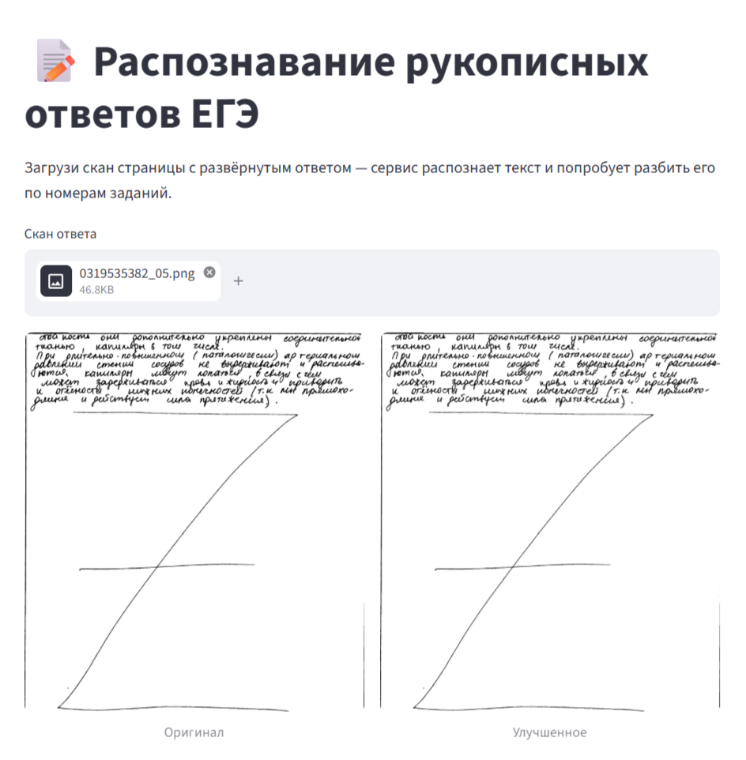

# Распознавание рукописного текста (OCR)

Сервис для распознавания рукописного русского текста на сканах страниц. Использует дообученную модель TrOCR (`kazars24/trocr-base-handwritten-ru`) и автоматически разбивает текст по номерам заданий (например, для ЕГЭ).

## Возможности

- **Загрузка скана** через веб-интерфейс (поддерживаются PNG, JPG, JPEG).
- **Предобработка изображения** для улучшения качества (повышение контраста, удаление шумов).
- **Распознавание текста** с помощью нейросети TrOCR.
- **Автоматическая сегментация** на строки и разбивка по номерам заданий.
- **Скачивание результата** в формате `.txt`.

## 📸 Примеры работы

| Скан | Результат |
|------|-----------|
|  | [Результат ](```text ход они долныю дажание прери
тнанью, капи меры в том числе И 1
При длительно. повышенном паталогически) ар териальном
давлении стен им сосуров не выдерживают и распешье-
бнотся. ка пипяры мещт попаться, в связи счем
может задерживаться провь и хирность п приводить
к отчности нихниж нонесно стей т.к мы прямохо-
длиция и дей ствуст сила прятижения). И
ГИ ти
М по М) 
