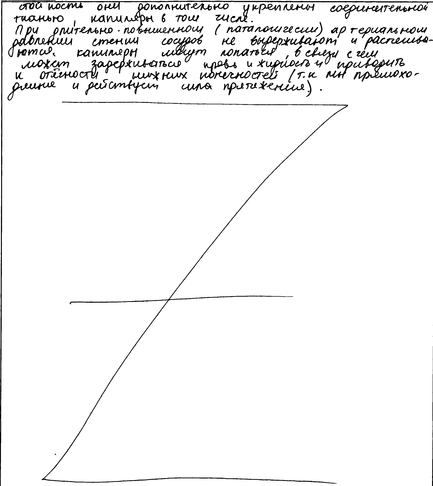
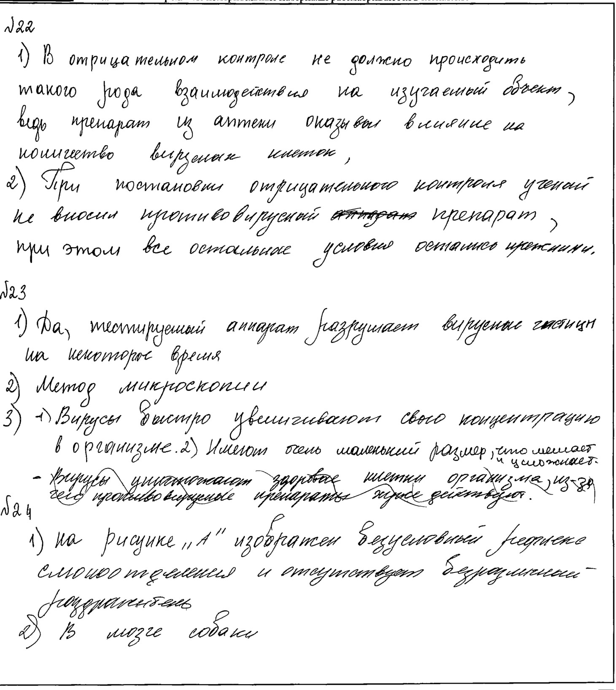

# Распознавание рукописного текста (OCR)

Сервис для распознавания рукописного русского текста на сканах страниц. Использует дообученную модель TrOCR (`kazars24/trocr-base-handwritten-ru`) и автоматически разбивает текст по номерам заданий (например, для ЕГЭ).

## Возможности

- **Загрузка скана** через веб-интерфейс (поддерживаются PNG, JPG, JPEG).
- **Предобработка изображения** для улучшения качества (повышение контраста, удаление шумов).
- **Распознавание текста** с помощью нейросети TrOCR.
- **Автоматическая сегментация** на строки и разбивка по номерам заданий.
- **Скачивание результата** в формате `.txt`.

## 📸 Примеры работы

| Скан | Результат |
|------|-----------|
|  | [Результат ](examples/recognized_text.txt).
|------|-----------|
|  | [Результат ](examples/recognized_text(1).txt).
